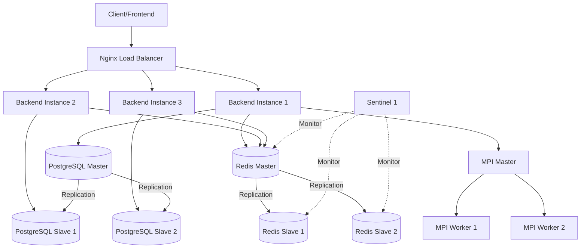

# Cluster Setup Guide

Complete guide for deploying and managing the distributed video translation cluster infrastructure.

## Architecture Overview



### Components

| Component | Count | Purpose |
|-----------|-------|---------|
| **Nginx** | 1 | Load balancer and reverse proxy |
| **Backend** | 3 | Application servers for processing |
| **PostgreSQL** | 3 | 1 master + 2 slaves for database replication |
| **Redis** | 3 + 1 | 3 nodes + 1 Sentinel for caching |
| **MPI Cluster** | 3 | 1 master + 2 workers for parallel processing |

**Total Containers**: ~13

## Quick Start

### Prerequisites

- Docker & Docker Compose installed
- Minimum 8GB RAM (16GB recommended)
- 4+ CPU cores
- 10GB free disk space

### 1. Configuration

Copy and configure environment variables:

```bash
cp .env.cluster.example .env.cluster
```

Edit `.env.cluster` and set secure passwords:

```bash
# IMPORTANT: Change these!
POSTGRES_PASSWORD=your_secure_password_here
POSTGRES_REPLICATION_PASSWORD=replicator_password_here
REDIS_PASSWORD=your_redis_password_here
SECRET_KEY=your_secret_key_here
```

### 2. Build and Start Cluster

```bash
# Build all images
docker-compose build

# Start all services
docker-compose up -d

# Check status
docker-compose ps
```

### 3. Verify Cluster Health

```bash
# PostgreSQL replication
docker exec postgres-master psql -U postgres -c "SELECT * FROM pg_stat_replication;"

# Redis cluster
docker exec redis-master redis-cli INFO replication

# MPI cluster
docker exec mpi-master mpirun -np 3 -hostfile /etc/mpi/hostfile python -c "from mpi4py import MPI; print(f'Rank: {MPI.COMM_WORLD.rank}')"

# Nginx status
curl http://localhost/nginx-status

# Backend health
curl http://localhost/api/health
```

## Configuration Details

### PostgreSQL Cluster

**Master Node** (`postgres-master`)
- Handles all WRITE operations
- Streams WAL logs to slaves
- Port: 5432

**Slave Nodes** (`postgres-slave1`, `postgres-slave2`)
- Handle READ operations
- Automatic replication from master
- Ports: 5433, 5434

**Connection Routing:**
- Writes → Master
- Reads → Round-robin across slaves

### Redis Cluster

**Master Node** (`redis-master`)
- Primary cache server
- Port: 6379

**Slave Nodes** (`redis-slave1`, `redis-slave2`)
- Replicate from master
- Automatic promotion on master failure
- Ports: 6380, 6381

**Sentinel** (`redis-sentinel1`)
- Monitors cluster health
- Automatic failover
- Quorum: 2 nodes

### MPI Cluster

**Master Node** (`mpi-master`)
- Coordinates parallel jobs
- SSH communication to workers

**Worker Nodes** (`mpi-worker1`, `mpi-worker2`)
- Execute parallel tasks
- Shared workspace volume

**When to Use MPI:**
- Videos > 60 seconds
- 2-3x faster processing
- Automatic load distribution

### Nginx Load Balancer

**Features:**
- Round-robin distribution
- Health checks
- WebSocket support
- Large file uploads (500MB)

**Endpoints:**
- `/api/*` → Backend services
- `/outputs/*` → Static video files
- `/health` → Health check
- `/nginx-status` → Load balancer stats

## Scaling Guide

### Scale Backend Instances

```bash
# Scale to 5 backend instances
docker-compose up -d --scale backend1=5
```

Update `nginx/nginx.conf` to add new upstream servers.

### Add More PostgreSQL Slaves

1. Add service to `docker-compose.yml`:

```yaml
postgres-slave3:
  build:
    context: ./postgres/slave
  # ... same config as slave1 ...
  ports:
    - "5435:5432"
```

2. Update backend environment:

```bash
POSTGRES_SLAVE_HOSTS=postgres-slave1,postgres-slave2,postgres-slave3
```

### Add More MPI Workers

1. Add worker to `docker-compose.yml`:

```yaml
mpi-worker3:
  build:
    context: ./mpi
  hostname: mpi-worker3
  # ... same config as worker1 ...
```

2. Update `mpi/hostfile`:

```
mpi-master slots=1
mpi-worker1 slots=1
mpi-worker2 slots=1
mpi-worker3 slots=1
```

## Monitoring

### View Logs

```bash
# All services
docker-compose logs -f

# Specific service
docker-compose logs -f backend1
docker-compose logs -f nginx
docker-compose logs -f postgres-master

# Last 100 lines
docker-compose logs --tail=100 backend1
```

### Resource Usage

```bash
# All containers
docker stats

# Specific container
docker stats postgres-master backend1 nginx
```

### Database Monitoring

```bash
# Active connections
docker exec postgres-master psql -U postgres -c "SELECT count(*) FROM pg_stat_activity;"

# Replication lag
docker exec postgres-master psql -U postgres -c "SELECT client_addr, state, sync_state, replay_lag FROM pg_stat_replication;"
```

### Cache Monitoring

```bash
# Redis info
docker exec redis-master redis-cli INFO stats

# Cache hit rate
docker exec redis-master redis-cli INFO stats | grep keyspace
```

## Troubleshooting

### PostgreSQL Slave Not Replicating

**Check replication status:**
```bash
docker exec postgres-slave1 psql -U postgres -c "SELECT pg_is_in_recovery();"
```

**Rebuild slave:**
```bash
docker-compose stop postgres-slave1
docker volume rm sister_postgres-slave1-data
docker-compose up -d postgres-slave1
```

### Redis Failover Not Working

**Check Sentinel status:**
```bash
docker exec redis-sentinel1 redis-cli -p 26379 SENTINEL master mymaster
```

**Manual failover:**
```bash
docker exec redis-sentinel1 redis-cli -p 26379 SENTINEL failover mymaster
```

### MPI Communication Error

**Generate SSH keys:**
```bash
docker exec mpi-master /bin/bash /mpi/generate_keys.sh

# Copy keys to workers
docker exec mpi-master cat ~/.ssh/id_rsa.pub | docker exec -i mpi-worker1 tee -a ~/.ssh/authorized_keys
docker exec mpi-master cat ~/.ssh/id_rsa.pub | docker exec -i mpi-worker2 tee -a ~/.ssh/authorized_keys
```

**Test SSH:**
```bash
docker exec mpi-master ssh mpi-worker1 echo "Connected"
```

### Nginx 502 Bad Gateway

**Check backend health:**
```bash
# Test direct backend connection
curl http://localhost:8000/health  # backend1
```

**Restart backends:**
```bash
docker-compose restart backend1 backend2 backend3
```

## Backup and Recovery

### Database Backup

```bash
# Backup
docker exec postgres-master pg_dump -U postgres transvidio > backup_$(date +%Y%m%d).sql

# Restore
cat backup_20250127.sql | docker exec -i postgres-master psql -U postgres transvidio
```

### Redis Backup

```bash
# Trigger save
docker exec redis-master redis-cli SAVE

# Copy RDB file
docker cp redis-master:/data/dump.rdb ./redis_backup_$(date +%Y%m%d).rdb
```

### Volume Backup

```bash
# Backup all volumes
docker run --rm \
  -v sister_postgres-master-data:/data \
  -v $(pwd):/backup \
  alpine tar czf /backup/postgres-master-backup.tar.gz /data
```

## Performance Tuning

### PostgreSQL

Edit `postgres/master/postgresql.conf`:

```conf
shared_buffers = 512MB  # Increase for more RAM
work_mem = 32MB
maintenance_work_mem = 128MB
```

### Redis

Edit `redis/redis-master.conf`:

```conf
maxmemory 1gb  # Increase cache size
```

### Nginx

Edit `nginx/nginx.conf`:

```nginx
worker_processes 4;  # Match CPU cores
worker_connections 2048;  # Increase for high traffic
```

## Security Best Practices

1. **Change default passwords** in `.env.cluster`
2. **Enable SSL/TLS** for Nginx (uncomment HTTPS block)
3. **Configure firewall** to restrict access
4. **Use secrets management** (Docker secrets, Vault)
5. **Regular updates** of Docker images
6. **Monitor logs** for suspicious activity

## Maintenance

### Regular Tasks

**Daily:**
- Check logs for errors
- Monitor resource usage

**Weekly:**
- Backup databases
- Review replication lag
- Check disk space

**Monthly:**
- Update Docker images
- Review and optimize queries
- Test failover procedures

### Updating Services

```bash
# Pull latest images
docker-compose pull

# Recreate containers
docker-compose up -d --force-recreate

# Or specific service
docker-compose up -d --force-recreate backend1
```

## Development vs Production

For **development** with limited resources, use scaled-down version:

```bash
# Use docker-compose.dev.yml (if created)
docker-compose -f docker-compose.dev.yml up -d
```

Or manually scale down:
- 1 PostgreSQL slave instead of 2
- 1 MPI worker instead of 2
- 1 backend instance instead of 3

## Support

For issues or questions:
1. Check logs: `docker-compose logs`
2. Review this documentation
3. Check Docker and service status
4. Consult service-specific documentation

---

**Next Steps**: See [DEPLOYMENT.md](DEPLOYMENT.md) for production deployment guide.
